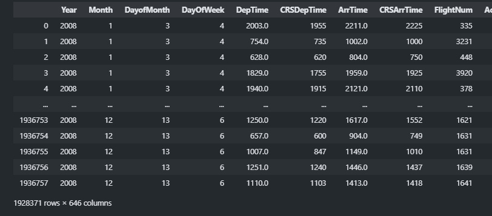
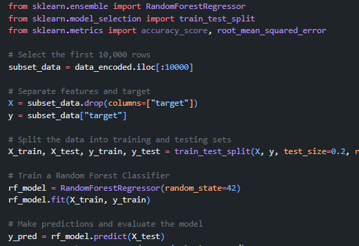
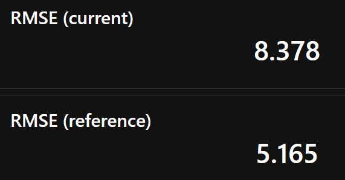
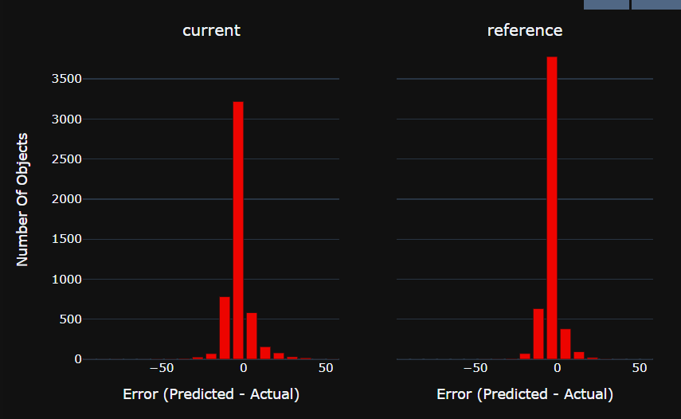
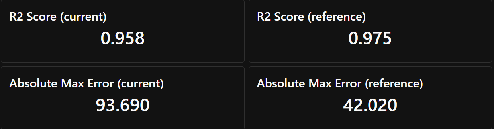

# CPE393-model-monitoring (References)

https://github.com/evidentlyai/ml_observability_course

https://www.analyticsvidhya.com/blog/2024/03/complete-guide-to-effortless-ml-monitoring-with-evidently-ai/

https://fullstackdeeplearning.com/course/2022/lecture-6-continual-learning/

# my result
first I clean the data set by remove "Unnamed: 0", "TailNum" columns as they are not related to the delay and use 'ArrDelay' as labelwhich represent arrival delay
then I use get dummy function to perform onhot encoding. then I remove null value and this is the final outcome

there are 1.9M record with 645 feature

## experiment setting
to simulate how data shifing effect model prediction I seperate data in these range

- 0-10000: model training and validationset
- 10001-15000: reference point as test set of the last time we train the model
- last 5000 rows: this represent the current data

first I train random forest regressor and the make prediction for both reference and current data

from the result from evidently it is very obious that as time pass by the error of the model prediction is incrreasing and become more distributed and this is exactly  why we need to monitor our model performance and update them accordingly.

